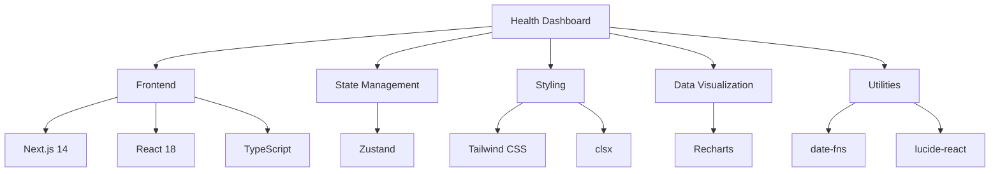

# 🩺 Health Dashboard

<div align="center">

[](https://nextjs.org/)
[](https://www.typescriptlang.org/)
[](https://tailwindcss.com/)
[](https://reactjs.org/)
[](LICENSE)
[](https://healdash.abirmahanta.site)

<br />

# 🌐 [LIVE DEMO](https://healdash.abirmahanta.site)

## 👉 [healdash.abirmahanta.site](https://healdash.abirmahanta.site) 👈

<br />

A comprehensive health metrics monitoring dashboard that simulates real-time data from wearable devices and visualizes it using interactive charts and various health management tools.

[Features](#-features) •
[Demo](#-demo) •
[Tech Stack](#-tech-stack) •
[Getting Started](#-getting-started) •
[Pages & Usage](#-pages--usage) •
[Roadmap](#️-roadmap) •
[License](#-license)

</div>

## 📋 Table of Contents

- [Features](#-features)
- [Demo](#-demo)
- [Tech Stack](#-tech-stack)
- [Getting Started](#-getting-started)
- [Pages & Usage](#-pages--usage)
- [Data Simulation](#-data-simulation)
- [Roadmap](#️-roadmap)
- [Contributing](#-contributing)
- [License](#-license)

## 🚀 Features

<details open>
<summary><b>Core Dashboard & Metrics</b> 📊</summary>
<br>

- **Real-time Health Metrics** ❤️: View your heart rate, blood oxygen, steps, sleep, body temperature, and blood pressure (systolic/diastolic).
- **Comprehensive Overview Tab** 📈: Includes quick stats, a detailed `MetricsGrid`, a `HealthGraph` for a selected metric, `DeviceStatusCard`, `HealthTrendCard`, and a `ScheduleCard` showing upcoming activities.
- **New Dashboard Components**:
    - `🎯 GoalProgressCard`: Track health and fitness goals.
    - `🍎 NutritionSummaryCard`: Log meals and monitor macronutrient intake.
    - `💊 MedicationCard`: Manage medication schedules and log doses.
    - `💧 HydrationTrackerCard`: Monitor water intake against daily targets.
- **Detailed Metrics Page (`/metrics`)**:
    - Select and view individual health metrics with detailed graphs.
    - Time range selection (24h, 7d, 30d, 90d).
    - Responsive graph display.
- **Interactive Data Visualization** 📊: Recharts-based graphs with zoom, toggle, and tooltip features.
- **Wearable Device Simulation** ⌚: Automatic generation of realistic health data.
- **Health Alerts** ⚠️: Warnings when metrics fall outside healthy ranges (conceptual, data generation supports it).

</details>

<details>
<summary><b>Application Pages & Functionality</b> 📱</summary>
<br>

- **AI Insights Page (`/ai-insights`)** 🤖: Provides mock AI-driven health insights and recommendations.
- **User Profile Page (`/profile`)** 👤: Basic form to update user profile information.
- **Settings Page (`/settings`)** ⚙️: Configure notification preferences, appearance (theme), account security (mock 2FA, password change), and data/privacy settings.
- **Login & Signup Pages (`/login`, `/signup`)** 🔐: Secure user authentication (mock implementation).
- **Messages Page (`/messages`)** 💬: Basic messaging interface with conversation list, chat area, and message input (mock data).
- **Reports Page (`/reports`)** 📝: Generate and view mock health reports with type selection and date range.
- **Schedule Page (`/schedule`)** 📅: Full-page calendar view with event management, allowing adding/editing of appointments and activities.
- **Activity Log Page (`/activity-log`)** 🏃‍♂️: Log and view various health-related activities with filtering and sorting.

</details>

<details>
<summary><b>Technical Features</b> 🛠️</summary>
<br>

- **Responsive Design** 📱: Works on desktop, tablet, and mobile.
- **Dark Mode Support** 🌙: Easy on the eyes for nighttime viewing (via Tailwind CSS).
- **Global Stylesheet** 🎨: Consolidated common styles in `app/globals.css`.

</details>

## 🎮 Demo

> 🚧 **Note**: Add screenshots or GIFs of your application here when available.

<div align="center">
<table>
  <tr>
    <td align="center">
      <strong>Dashboard</strong><br>
      <i>Main health overview</i>
    </td>
    <td align="center">
      <strong>Metrics</strong><br>
      <i>Detailed health tracking</i>
    </td>
  </tr>
  <tr>
    <td width="50%">
      <p align="center">[Dashboard Screenshot Placeholder]</p>
    </td>
    <td width="50%">
      <p align="center">[Metrics Screenshot Placeholder]</p>
    </td>
  </tr>
</table>
</div>

## 🔧 Tech Stack



<details>
<summary><b>Complete Tech Stack</b></summary>
<br>

- **Frontend**: Next.js 14 with React 18, TypeScript
- **Styling**: Tailwind CSS with dark mode support, `clsx` for conditional classes
- **Charts**: Recharts for interactive data visualization
- **State Management**: Zustand for global client-side state
- **Date Utilities**: `date-fns` for date manipulations
- **Icons**: `lucide-react` for UI icons
- **Data Handling**: Custom data generation utilities for mock data

</details>

## 🚀 Getting Started

### Prerequisites

- Node.js 18.0.0 or higher
- npm (comes with Node.js)

### Installation

<details>
<summary><b>Step-by-step guide</b></summary>
<br>

1.  Clone the repository:
    ```bash
    git clone https://github.com/itsmeabirmohanta/health-dashboard.git
    cd health-dashboard
    ```

2.  Install dependencies:
    ```bash
    npm install
    ```

3.  Run the development server:
    ```bash
    npm run dev
    ```

4.  Open [http://localhost:3000](http://localhost:3000) (or the port specified in your console, often 3001 if 3000 is busy) in your browser.

</details>

## 📄 Pages & Usage

<div align="center">

| Page | Path | Description |
|------|------|-------------|
| **Dashboard** | `/` | Main landing page with overview of all key health metrics |
| **Metrics** | `/metrics` | Detailed view of individual health metrics with graphs |
| **AI Insights** | `/ai-insights` | AI-driven health insights and recommendations |
| **Messages** | `/messages` | Messaging interface for communication |
| **Reports** | `/reports` | Generate and view health reports |
| **Schedule** | `/schedule` | Calendar view to manage health-related events |
| **Activity Log** | `/activity-log` | Log and view various health activities |
| **Profile** | `/profile` | Manage user profile information |
| **Settings** | `/settings` | Customize application settings |
| **Login** | `/login` | User login page |
| **Signup** | `/signup` | User registration page |

</div>

## 🔄 Data Simulation

The dashboard uses simulated data to mimic real wearable devices and user inputs. This is located primarily in:

```typescript
// Mock health metrics data generation
import { generateCurrentMetrics, generateHistoricalData } from 'app/store/healthDataSets.ts';

// Additional dashboard mockups (goals, nutrition, etc.)
import { 
  mockGoals, 
  mockNutritionSummary,
  mockMedications, 
  mockHydrationSummary 
} from 'app/store/mockDashboardData.ts';
```

In a production environment, this would be replaced with API calls to actual health platforms and backend services.

## 🛣️ Roadmap

<div align="center">

| Status | Feature | Priority |
|--------|---------|----------|
| ⏳ | Full backend integration | High |
| ⏳ | Real user authentication | High |
| ⏳ | Persistent data storage | Medium |
| ⏳ | Exportable health reports | Medium |
| ⏳ | Wearable device API integration | Medium |
| ⏳ | Real-time notifications | Low |
| ⏳ | Advanced AI insights | Low |
| ⏳ | I18n and localization | Low |
| ⏳ | Comprehensive testing | High |

</div>

## 👥 Contributing

Contributions are welcome! Please feel free to submit a Pull Request.

1. Fork the repository
2. Create your feature branch (`git checkout -b feature/amazing-feature`)
3. Commit your changes (`git commit -m 'Add some amazing feature'`)
4. Push to the branch (`git push origin feature/amazing-feature`)
5. Open a Pull Request

## 📄 License

This project is licensed under the MIT License - see the [LICENSE](LICENSE) file for details.

---

<div align="center">

**Created by [Abir Mahanta](https://github.com/itsmeabirmohanta) | © 2025**

[](https://github.com/itsmeabirmohanta/health-dashboard/stargazers)
[](https://github.com/itsmeabirmohanta/health-dashboard/network/members)

</div>
